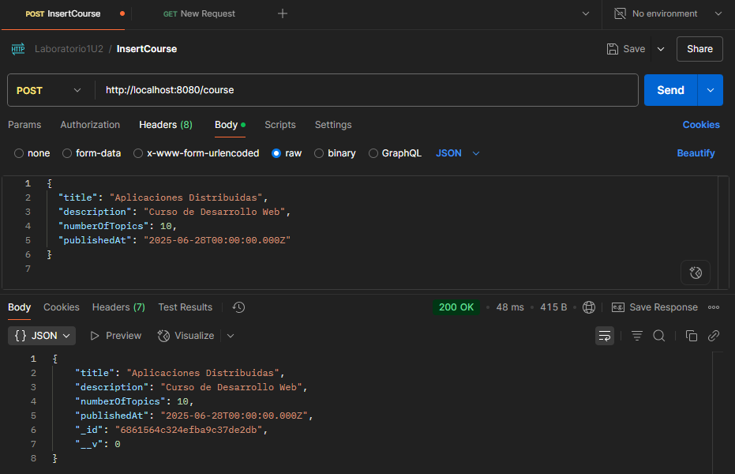
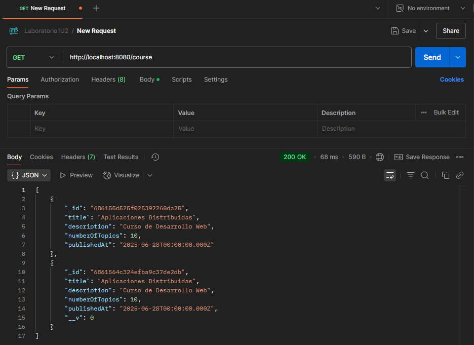
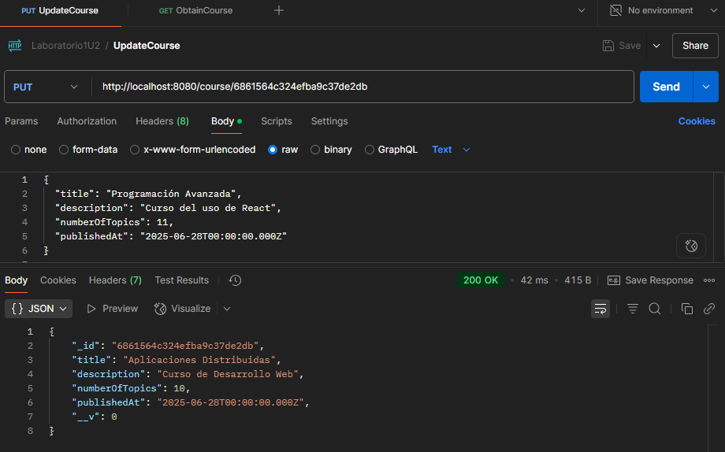
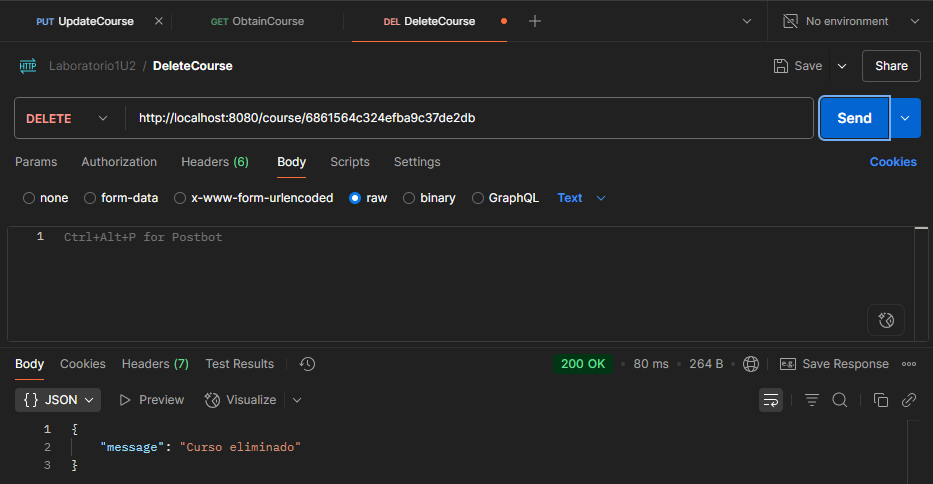
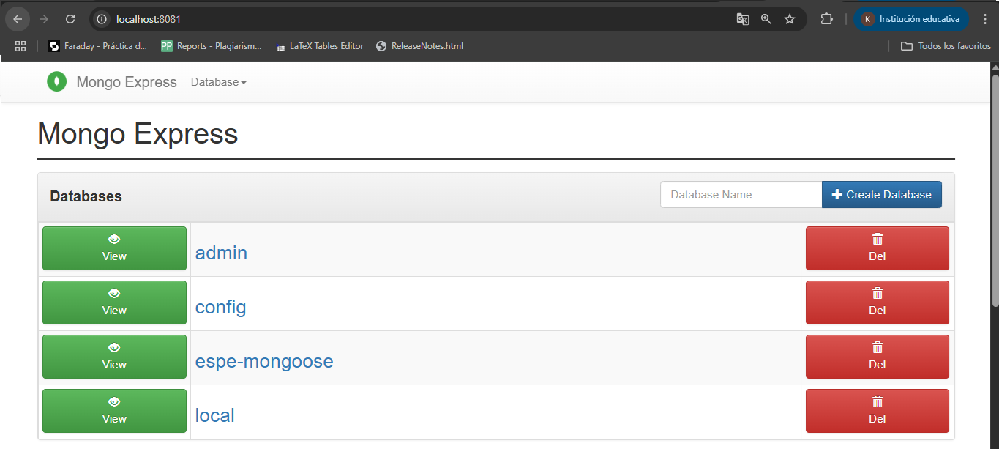
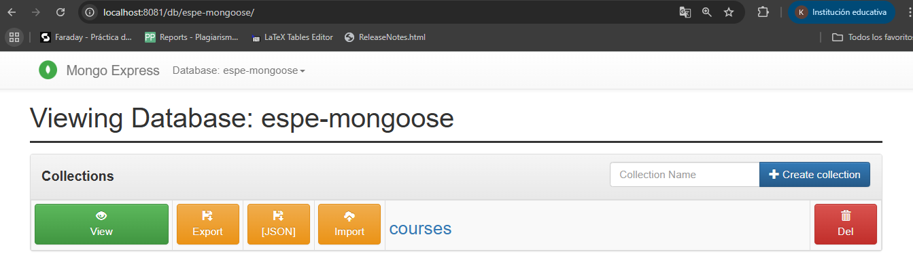
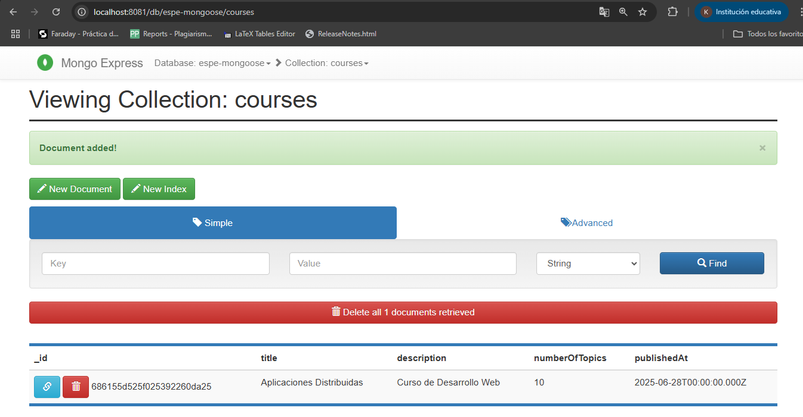

| **DEPARTAMENTO:** Ciencias de la Computación | **CARRERA:** Ingeniería en Tecnologías de la Información |
|----------------------------------------------|----------------------------------------------------------|
| **ASIGNATURA:** Aplicaciones Distribuidas    | **NIVEL:** 7to           | **FECHA:** 28/06/2025     |
| **DOCENTE:** Ing. Paulo Galarza              | **PRÁCTICA N°:** 1       | **CALIFICACIÓN:**         |

**Repositorio GitHub:** [https://github.com/gregoryNa9/Laboratorio1U2.git](https://github.com/gregoryNa9/Laboratorio1U2.git)

# Implementación de una API RESTful con Node.js, Express y MongoDB usando Mongoose

**Nombre del estudiante:**  
Karlos Gregory CHevez Bazan

---

## RESUMEN

En esta práctica se desarrolló un sistema de gestión de cursos utilizando una API RESTful implementada con Node.js, Express y MongoDB. Se aplicó el ODM Mongoose para modelar los datos, definir validaciones y facilitar las operaciones sobre la base de datos. Además, se empleó Docker y docker-compose para orquestar servicios de base de datos y administración visual con mongo-express. Las pruebas funcionales se realizaron mediante Postman, asegurando el correcto funcionamiento de los endpoints CRUD. Se trabajó de forma modular, organizando el código por modelos, controladores y rutas. Este enfoque permitió una mayor escalabilidad, mantenibilidad y seguridad. Se concluyó que el uso de un ORM y herramientas de contenedorización optimiza el flujo de desarrollo y despliegue en proyectos backend.

**Palabras Claves:** API REST, Mongoose, MongoDB

---

## 1. INTRODUCCIÓN

La presente práctica tuvo como finalidad la implementación de una API RESTful para gestionar información de cursos, desarrollando habilidades en programación backend y administración de bases de datos. Se emplearon herramientas modernas como Docker y mongo-express, promoviendo el uso disciplinado del entorno de laboratorio y reforzando el manejo de arquitectura distribuida. Esta experiencia permitió aplicar los conceptos vistos en clase y afianzar buenas prácticas de desarrollo, estructura de código y pruebas funcionales de servicios web.

---

## 2. OBJETIVO(S)

2.1 Desarrollar una API RESTful organizada utilizando Node.js y Express.  
2.2 Aplicar Mongoose como ODM para la gestión de datos con MongoDB.  
2.3 Desplegar servicios mediante Docker y administrar la base de datos con mongo-express.
2.4 Validar el funcionamiento de la API mediante pruebas con Postman.

---

## 3. MARCO TEÓRICO

Una API RESTful permite exponer recursos y operaciones a través de endpoints HTTP. Su estructura sigue principios de arquitectura como statelessness, manipulación de recursos mediante URIs y uso de métodos estándar (GET, POST, PUT, DELETE). Express es un framework de Node.js que facilita la creación de estas APIs mediante enrutamiento flexible y middlewares. MongoDB, al ser una base de datos NoSQL orientada a documentos, permite mayor flexibilidad en la estructura de los datos. 
Mongoose es un ODM (Object Data Modeling) para MongoDB y Node.js, que facilita la creación de esquemas, validaciones, y consultas estructuradas, mejorando la organización del código y la seguridad. Por su parte, Docker permite encapsular servicios en contenedores, mientras que docker-compose facilita la orquestación de múltiples servicios, como bases de datos y clientes de administración como mongo-express.

---

## 4. DESCRIPCIÓN DEL PROCEDIMIENTO

---
Se inició creando la estructura básica del proyecto con carpetas separadas para modelos, rutas y controladores. Se configuró un archivo .env para el manejo seguro de variables de entorno. Posteriormente, se desarrollaron los modelos en Mongoose y se construyeron los endpoints CRUD de la API usando Express.
Para el entorno de ejecución se usó Docker, con un archivo docker-compose.yml que definió dos contenedores: uno para MongoDB y otro para mongo-express. Se realizaron pruebas de cada endpoint en Postman para asegurar su correcto funcionamiento. Finalmente, se capturaron evidencias visuales del proceso en cada etapa.
---

- Se creó la estructura del proyecto separando modelos, rutas y controladores.
- Se configuró el archivo `.env` para manejar variables sensibles.
- Se implementó el archivo `docker-compose.yml` para levantar MongoDB y mongo-express.
- Se desarrollaron los endpoints CRUD para el recurso "curso" con lo cual se realizo pruebas de los endpoints usando Postman.

---

## 5. ANÁLISIS DE RESULTADOS

Durante las pruebas, se comprobó que todos los endpoints funcionaban correctamente:

- En la Figura 1, se muestra la creación exitosa de un curso mediante POST (ingresarCurso.png).
- La Figura 2 refleja la consulta de cursos ya registrados (obtenerCurso.png).
- La Figura 3 presenta la actualización de un curso mediante PUT (actualizarCurso.png).
- En la Figura 4, se observa la eliminación del recurso (eliminarCurso.png).
- La Figura 5 evidencia que el curso ya no se encuentra tras la eliminación (obtenerCurso PostEliminar.png).
- En la Figura 6, se muestra la interfaz general de mongo-express (mongo-express.png).
- Las Figuras 7 y 8 muestran el acceso a la colección courses y el detalle de un documento dentro de mongo-express (mongo-express1.png, mongo-express2.png).

Estas evidencias confirman la operatividad completa del sistema implementado.

---

## 6. GRÁFICOS O FOTOGRAFÍAS

**Creación de un curso en Postman:**  

**Consulta de cursos en Postman:**  

**Actualizar cursos en Postman:**  

**Eliminar cursos en Postman:**  

**Consulta después de la eliminación:**  

**Interfaz general de mongo-express:**  

**Vista de la colección `courses` en mongo-express:**  

**Detalle de un documento en mongo-express:**  

---

## 7. DISCUSIÓN

Los resultados obtenidos coinciden con los principios del desarrollo backend moderno. El uso de Mongoose facilitó la definición clara de estructuras de datos y sus respectivas validaciones. Asimismo, la aplicación de Docker permitió una configuración rápida y efectiva del entorno de ejecución, reduciendo el margen de errores de instalación o versiones.
Se evidenció que al seguir una estructura modular y ordenada en el proyecto, el mantenimiento, comprensión y escalabilidad del mismo se facilita significativamente. Las herramientas utilizadas demostraron ser adecuadas para este tipo de desarrollos y resultan altamente recomendables para futuros proyectos similares.

---

## 8. CONCLUSIONES

- La implementación de la API RESTful con Node.js, Express y Mongoose permitió desarrollar un sistema funcional y bien estructurado, cumpliendo con los objetivos planteados en la práctica.
- El uso de Docker y mongo-express facilitó la configuración del entorno y la administración visual de la base de datos, demostrando la utilidad de estas herramientas en proyectos distribuidos.
- Las pruebas con Postman y la estructura modular del código validaron el correcto funcionamiento del sistema, reforzando buenas prácticas de desarrollo backend.

---

## 9. BIBLIOGRAFÍA

- MongoDB, Inc. (2024). [MongoDB Manual](https://docs.mongodb.com/). Consulta: 28/06/2025.
- Express.js Foundation. (2024). [Express Documentation](https://expressjs.com/). Consulta: 28/06/2025.
- Automattic. (2024). [Mongoose Documentation](https://mongoosejs.com/docs/). Consulta: 28/06/2025.